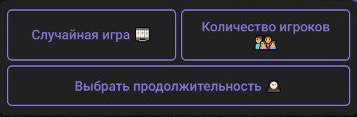
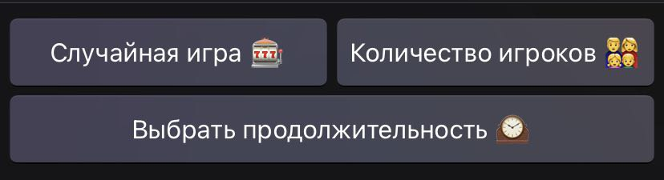
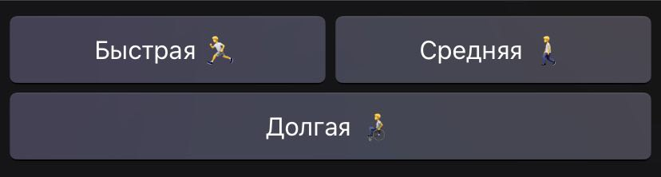

<h1>Бот для генерации игр</h1>
<h2>Описание</h2>
Этот бот для Telegram предназначен для генерации случайной игры по заданным критериям. 
Пользователи могут выбрать игру по количеству игроков, продолжительности игры или получить случайную игру из списка.
  <b>Версия с компьютера</b>:    <b>Версия с телефона</b>:  
<h2>Каак использовать.</h2>
Для запуска бота вам необходимо указать токен в строке:  <b>bot = telebot.TeleBot = ('Token')</b>.
Далее запустите файл и добавьте бота в вашу группу или напишите ему в личные сообщения.
При запуске бота вы получите приветственное сообщение и набор кнопок для выбора критериев игры. Вы можете выбрат один из следующих вариантов:  
<ul>
<li><b>Случайная игра</b> - получить слуйчаную игру из списка</li>
<li><b>Количество игроков</b> - выбрать игру по количеству игроков</li>
<li><b>Продолжительность игры</b> - выбрать игру по продолжительности</li></ul>
<h2>Выбор игры по количеству игроков</h2>
После выбора этой опции вам будет предложенно ввести количество игроков.
Затем бот выведет список игр, которые подходят для выбранного количества игроков. Если список пустой, бот сообит об этом.
<h2>Выбор по продолжительности</h2>
После выбора этой опции вам будет предоставлен выбор продолжительности игры - Быстрая, Средняя или Долгая.
 
Затем бот выведет список игр, которые подходят для выбранной продолжительности и количества игроков (если количество игроков было указано).
Если список не пустой, вы можете выбрать одну из игр. Если список пустой, бот сообщит вам об этом.
<h2>Получение случайной игры</h2>
При выборе этой опции бот случайным образом выберет игру из списка и отправит её вам.
Бот написан с помощью библиотеки telebot. Для установки библиотеки необходимо выполнить команду: <b>pip install pyTelegramBotApi</b>.
<h2>Исключение ввода</h2>
При вводе недопустимого значения, бот выдаст соответствующее сообщение и отправит кнопку для возврата в меню:  
<h2>Запуск после ошибок</h2>
При получении ошибки, в работе бота, бот будет перезапускаться после 5с: 
\n...except Exception as e:
      time.sleep(5)
<h2>Автор</h2>
Бот разработан <strong><a href='t.me/Whiskalik'>@Whiskalik</a></strong>. Если у вас есть вопросы или предложения, пожалуйста, свяжитесь со мной.
